<p align="center">
  
</p>

<p align="center">
  <em>Reproductor de música de escritorio con backend yt-dlp.<br/>
  Streaming, descargas offline, playlists y un modo "Lucid" que tiñe la app con el color de la portada actual.</em>
</p>

---

## Qué es Vinyl

Vinyl es una aplicación de escritorio (Electron + React) para escuchar música extraída de YouTube. Las canciones se pueden reproducir en streaming o descargar a tu disco para escucharlas sin conexión. Toda la biblioteca (descargas, "Me gusta", playlists) vive en local, no hay cuenta ni telemetría.

## Características

- 🎵 **Búsqueda y reproducción** desde YouTube vía yt-dlp.
- ⬇️ **Descargas a m4a** con barra de progreso, gestionables desde la vista *Descargas*.
- ❤️ **Me gusta** y **playlists** locales (SQLite).
- 🎨 **Dos temas**:
  - **Normal**: paleta cálida con acentos rubí.
  - **Lucid**: glass translúcido + color dominante extraído de la portada de la canción actual. Afecta toda la app (scrollbar incluida). Inspirado en [Spicetify Lucid](https://spicetify-lucid.sanooj.uk/).
- 📂 **Carpeta de descargas configurable**: cambiar la ubicación mueve las descargas existentes.
- 🍪 **Cookies de YouTube** configurables para evitar errores 429 / *"Too Many Requests"*.
- 🖼️ **Mini-player** flotante siempre encima.
- 🎬 **Modo pantalla completa** con la portada gigante.
- 🪟 **Botones de la barra de tareas** (play/pause/prev/next/like) en la miniatura de Windows.
- ◀️▶️ **Historial de navegación** estilo navegador (Alt+←/→ y botones laterales del ratón).

## Capturas

### Inicio
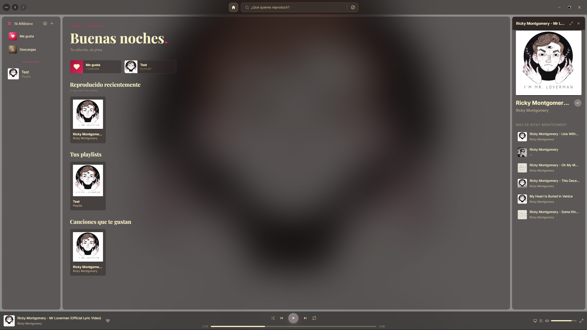

### Explorar por género
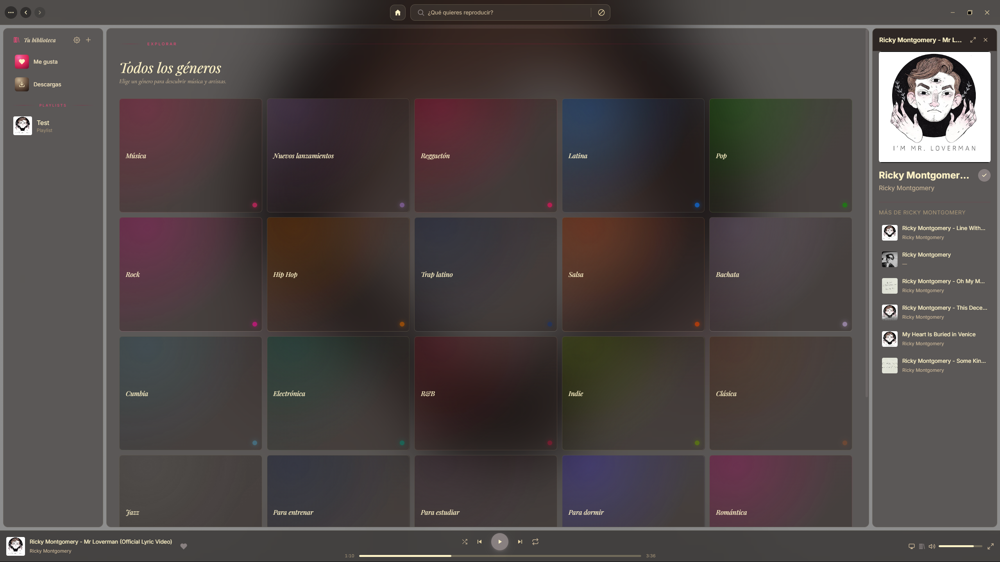

### Búsqueda
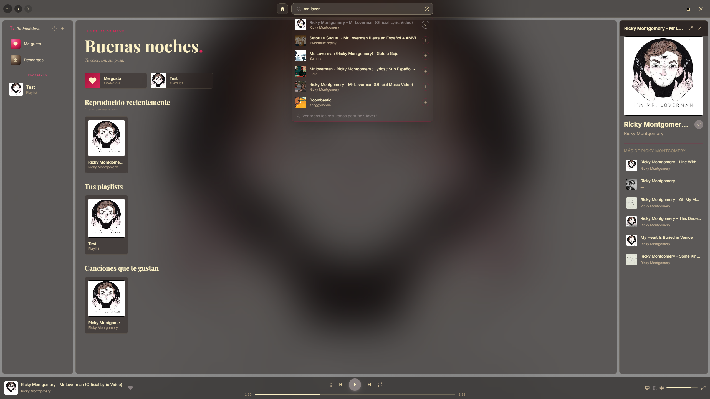

### Tu biblioteca · Me gusta
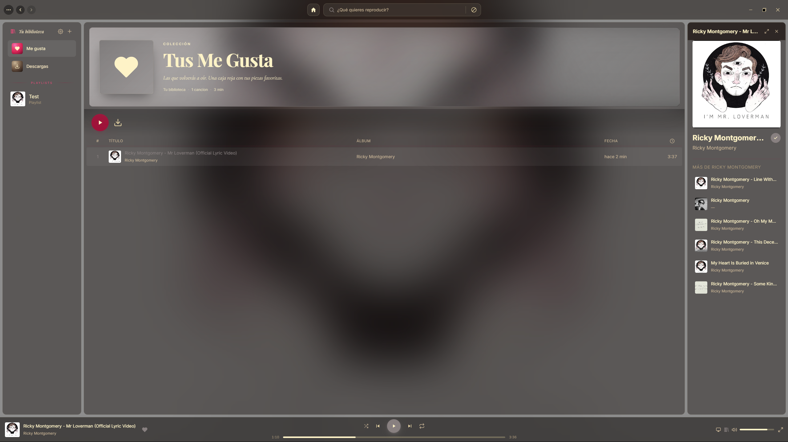

### Descargas
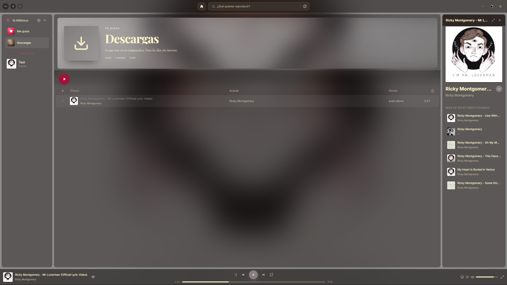
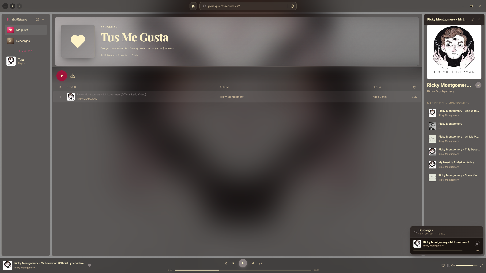

### Playlists
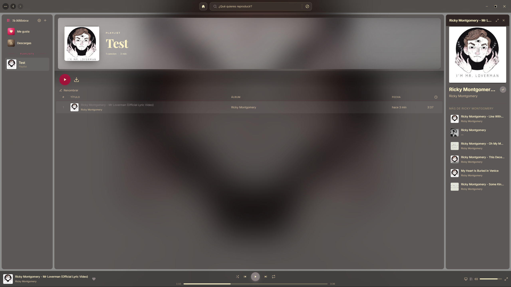
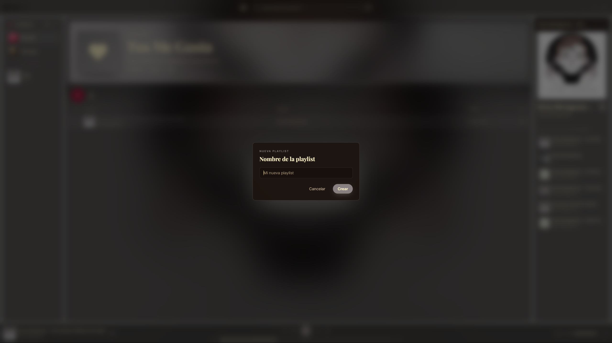
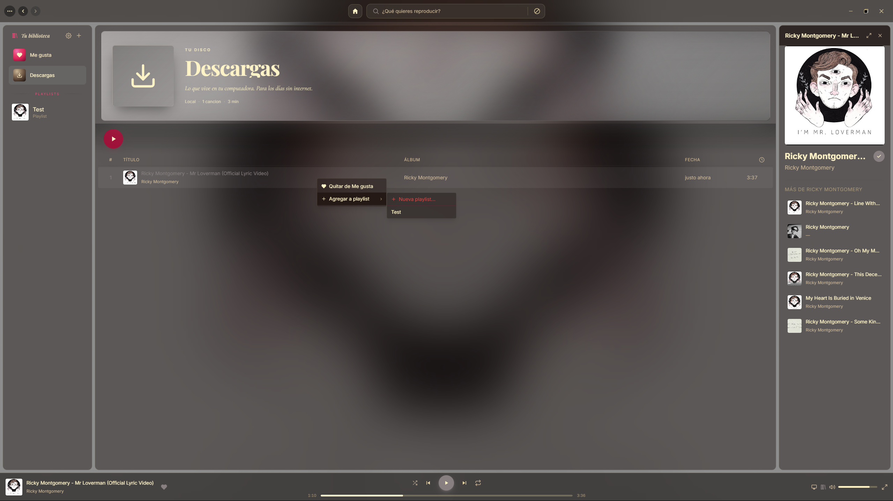

### Reproducción
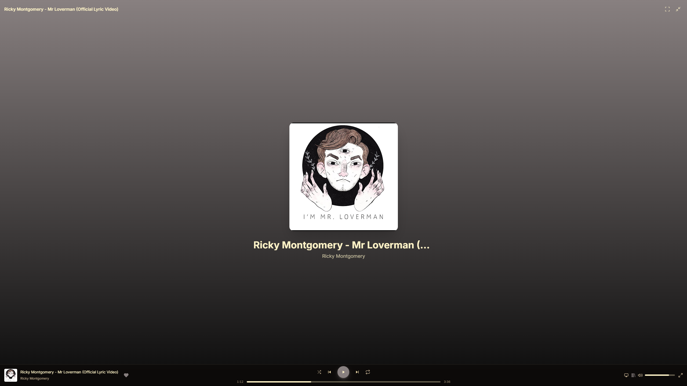
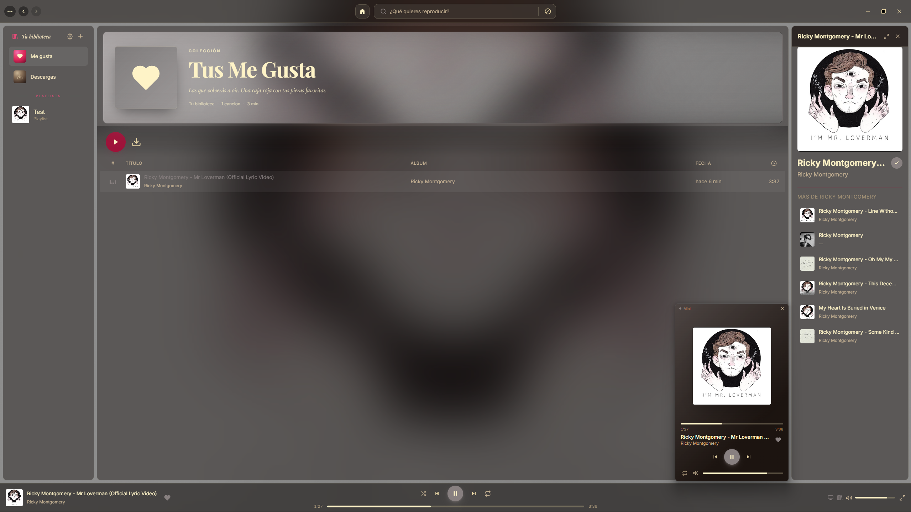

### Configuración
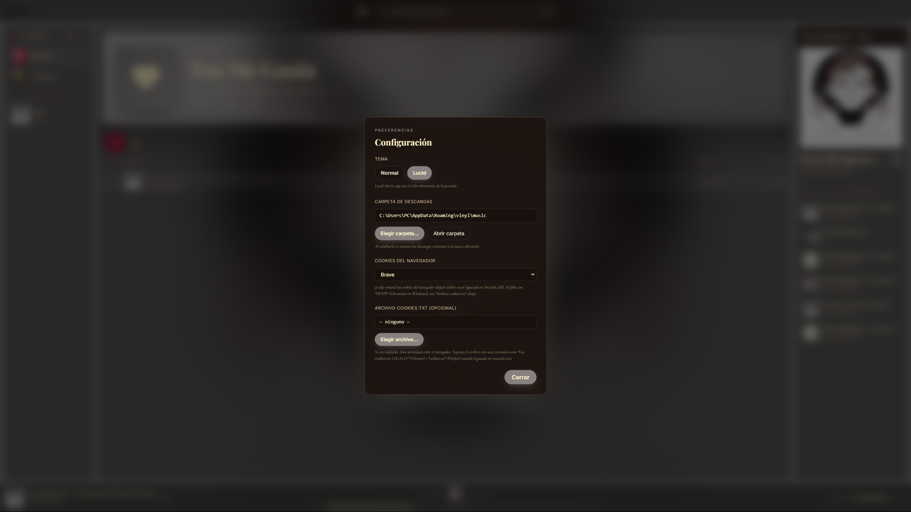

---

## Instalación (usuarios)

1. Descarga el `.exe` desde la sección **Releases** del repositorio.
2. Doble click. Windows SmartScreen avisará ("Editor desconocido") — *Más información → Ejecutar de todos modos*. La app no está firmada digitalmente porque firmarla requiere un certificado de pago.
3. Listo. La versión portable se ejecuta sin instalar; el instalador NSIS crea acceso directo.

Datos de usuario (biblioteca, descargas, configuración) se guardan en `%APPDATA%\Vinyl\`.

---

## ⚙️ Configuración

La configuración se abre desde el **icono de engranaje en la cabecera del sidebar** (o desde *Ver → Configuración…*).

### Tema

Dos opciones:

- **Normal**: paleta cálida con acentos rubí y tipografía serif italic.
- **Lucid**: vidrio translúcido sobre un fondo que toma el color dominante de la portada de la canción actual. Cuando no hay canción sonando, vuelve a un tono carbón neutro. Inspirado en el theme [Spicetify Lucid](https://spicetify-lucid.sanooj.uk/) de Sanooj.

### Carpeta de descargas

Por defecto las descargas se guardan en `%APPDATA%\Vinyl\music\`. Puedes cambiarla a cualquier carpeta del sistema desde el botón **"Elegir carpeta…"**. Al cambiarla, **los archivos ya descargados se mueven automáticamente** a la nueva ubicación. Si algún archivo no se puede mover (por ejemplo, está siendo reproducido en ese momento), se informa cuántos quedaron en la carpeta anterior.

### 🍪 Cookies (importante)

YouTube limita las peticiones por IP. Si yt-dlp hace demasiadas consultas seguidas, devuelve errores `HTTP 429 Too Many Requests` y la búsqueda / reproducción dejan de funcionar. La solución es que yt-dlp se identifique con cookies de una sesión real de YouTube.

Vinyl ofrece dos formas:

#### Opción 1 — Navegador (más simple, no siempre funciona)

En el desplegable **"Cookies del navegador"** eliges Chrome, Firefox, Edge, etc. yt-dlp intentará leer las cookies del perfil de ese navegador.

> **Limitación en Windows**: desde Chromium 127+ (Chrome / Edge / Brave / Opera) las cookies están cifradas con *App-Bound Encryption* y yt-dlp **no puede desencriptarlas** ([issue #10927](https://github.com/yt-dlp/yt-dlp/issues/10927)). Verás un error tipo *"Failed to decrypt with DPAPI"*. Firefox sí funciona si lo tienes instalado.

#### Opción 2 — Archivo `cookies.txt` (recomendado) ✅

La forma robusta y la que recomiendo. Exportas tus cookies de YouTube a un archivo `.txt` y se lo pasas a Vinyl. Funciona en cualquier navegador y esquiva el problema de DPAPI.

1. Instala una extensión de exportación en tu navegador:
   - **Chrome / Edge / Brave**: [**Get cookies.txt LOCALLY**](https://chromewebstore.google.com/detail/get-cookies-txt-locally/cclelndahbckbenkjhflpdbgdldlbecc) (gratis, código abierto, no envía nada a la nube).
   - **Firefox**: [**cookies.txt**](https://addons.mozilla.org/en-US/firefox/addon/cookies-txt/).
2. Abre [youtube.com](https://www.youtube.com) e inicia sesión.
3. Click en la extensión → **Export** → guarda el archivo (p. ej. `youtube-cookies.txt` en `Documentos`).
4. En Vinyl: **Configuración → Archivo cookies.txt → Elegir archivo…** y selecciona ese `.txt`.

A partir de aquí yt-dlp irá autenticado y los errores 429 desaparecen. El archivo tiene prioridad sobre la opción "Cookies del navegador", así que puedes dejar esa en *Ninguno*.

> ⚠️ **Las cookies caducan**. YouTube las invalida tras un tiempo (semanas / meses, depende de actividad). Si vuelves a tener errores 429 más adelante, basta con re-exportar el archivo y seleccionarlo de nuevo.
>
> 🔒 **No subas tu `cookies.txt` a ningún sitio**. Contiene tokens de sesión equivalentes a tu contraseña.

---

## Atajos

| Atajo | Acción |
|---|---|
| `Espacio` | Play / pausa |
| `Alt + ←` / `Alt + →` | Atrás / adelante en el historial |
| Botones laterales del ratón | Atrás / adelante |
| Click derecho sobre canción | Menú contextual (añadir a playlist, descargar, etc.) |

---

## Desarrollo

### Requisitos

- **Node.js 18+**
- **ffmpeg** en el `PATH` (yt-dlp lo necesita para convertir el audio a m4a)
  - Windows: `winget install ffmpeg`
- *(opcional)* yt-dlp en el `PATH` — si no, el script `fetch:ytdlp` descarga el binario adecuado a `resources/` antes de cada build.

### Setup

```bash
git clone <url-del-repo>
cd Vinyl
npm install
```

`better-sqlite3` se compila contra Electron. Si falla:

```bash
npx electron-rebuild
```

### Desarrollo

```bash
npm run dev       # Vite en localhost:5173 (en una terminal)
npm run electron  # ventana Electron apuntando a Vite (en otra terminal)
```

### Build

```bash
npm run build:portable    # un .exe portable autónomo (~93 MB)
npm run build:installer   # instalador NSIS
npm run build             # ambos
```

Resultado en `release/`. El script `fetch:ytdlp` se encarga de descargar `yt-dlp.exe` automáticamente la primera vez.

### Estructura

```
electron/        Proceso principal: yt-dlp wrapper, SQLite, settings, IPC
src/             UI React (renderer)
scripts/         fetch-ytdlp.js — descarga el binario yt-dlp
resources/       yt-dlp.exe (no commiteado)
imgs/            Logo, banner, screenshots
```

---

## Tech stack

- **Electron 33** (desktop shell)
- **React 18** + **Vite** (UI)
- **Tailwind CSS 3** + tipografías Playfair Display / Cormorant Garamond / Inter
- **Zustand** (estado global)
- **better-sqlite3** (biblioteca local)
- **yt-dlp** (búsqueda y descarga)

---

## Créditos e inspiración

- **Modo Lucid**: la idea del vidrio translúcido con tinte adaptativo al color dominante de la portada está inspirada en [**Spicetify Lucid**](https://spicetify-lucid.sanooj.uk/), de [Sanooj](https://github.com/Sanoojes). Un theme excelente para Spicetify; si usas Spotify oficial, échale un ojo.
- **[yt-dlp](https://github.com/yt-dlp/yt-dlp)** — el motor de búsqueda y descarga. Unlicense / dominio público.
- **[Electron](https://www.electronjs.org/)**, **[React](https://react.dev/)**, **[Vite](https://vitejs.dev/)**, **[Tailwind CSS](https://tailwindcss.com/)**, **[Zustand](https://github.com/pmndrs/zustand)**, **[better-sqlite3](https://github.com/WiseLibs/better-sqlite3)** — todo el stack que hace posible la app.

## Licencia

MIT.

Esta app no está afiliada a YouTube, Google, Spotify ni a Spicetify Lucid. El uso de contenido con derechos de autor es responsabilidad del usuario.
